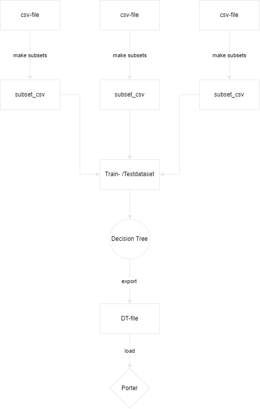
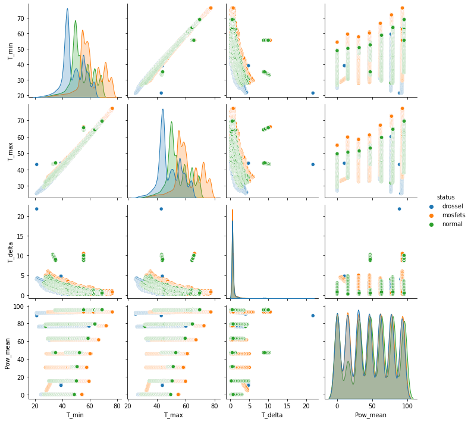

# Description:

## Introduction:
For the static data generation we tested the below dcdc-Converters. They were all tested with different loads     (0A, 1A, 2A, 3A, 4A, 5A, 6A). Communication: 115200 kbps UART, delay(2) excluded. Every recording had a duration of 30 minutes. We also measured the room temperature to have a reference value.

    We used three different dcdc-Converter:
        - DCHY2400-08 (Normal)
        - DCHY2400-15 (manipulated with Drossel)
        - DCHY2400-12 (manipulated with Mosfets)


    
For the recording an input voltage of 24V was used. The measurements were determined with a Arduino UNO through I2C(100 kHz) and sent to a Raspberry PI 4 with UART(baudrate: 115200). For the audio amplifier a "Conrad Components Stereo-Verstärker Bausatz 9 V/DC, 12 V/DC, 18 V/DC 35 W 2 Ω" with 2 x 35 W NF-Verstärker was used. The input voltage for the amplifier was 12V. The resistor load is 2.5 Ω.

    We used the same three different dcdc-Converter:
        - DCHY2400-08 (Normal)
        - DCHY2400-15 (manipulated with Drossel)
        - DCHY2400-12 (manipulated with Mosfets)
    
For the audio signal a normal pc/laptop which played a MP3-File was used.
### Steps:
#### 1. Data recording/generation for "NORMAL"-dcdc
    data for every song(3) was recorded thrice and labeled as V1, V2, V3
#### 2. Data recording/generation for "DROSSEL"-dcdc
    data for every song(3) was recorded thrice and labeled as V1, V2, V3
#### 3. Data recording/generation for "MOSFET"-dcdc
    data for every song(3) was recorded thrice and labeled as V1, V2, V3

### Songs:
    Labeled as NG <--- Rick Astley - Never Gonna Give You Up: https://www.youtube.com/watch?v=dQw4w9WgXcQ

    Labeled as PIECES <--- AVAION, VIZE, Leony - Pieces: https://www.youtube.com/watch?v=mMbGQkvxVag
    
    Labeled as NEELIX <--- Neelix - The Twenty Five: https://www.youtube.com/watch?v=SPY1sGZN6hc

## Background:
Repository which processes the recordings/data of DCDC-Converter regarding V_in, V_out, Current, OnBoard temperature and room temperature. It contains all the necessary 
preprocessing function to clean the data, transform it into the right data format and stores the final dataset for train-, test- and validationset. Further it also includes the Machine Learning part.



## Data Exploration:
After the whole process of cleaning the data, transforming it into the right shape and calculating significant values which are required to make statements. An visualisation of the final audio recordings csv-file (its emergence was explained in the previous step). On the x-axis, the maximal temperature is depicted, on the y-axis the mean power is scaled. The data is classified regarding the dcdc-type (Normal, Mosfets, Drossel) and the song title (Neelix, Ng, Pieces)


Nearly the same was done with the static dataset. Instead of using the same method for plotting the results, seaborn's sns.pairplot() was used to create a map of different visualization plots. The data is classified regarding the dcdc-type (Normal, Mosfets, Drossel)


## Installation:
#### using python 3.10.5

```python
# Create environment and upgrade package manager
python3 -m venv venv

# Activate venv
venv\Scripts\activate

# Install the requirements
pip install -r requirements.txt
```

## Project Structure:

### 1. Layer of data preprocessing

In this layer the original, raw data files are processed and cleaned. This means that there can be faulty rows with more than expected features, or the syntax of the files has to be edited (f.ex. leave out the brackets [ ; ]). The data files are also transformed into the needed csv-format with the right column names in the header.
### 2. Layer of data preprocessing 

In the *converter_relevant_operations.ipynb* you can find the code for processing all the edited files regarding the shift and subset function. You have to devide the whole datafiles into subsets with a specific range to then afterwards calculate the significant features like:
    - mean of power
    - max. temperature
    - min. temperature
    - delta of temperature

```python
make_subsets(df: pd.DataFrame, size: int, status: str, shift: int, song_title: str)
```
In this function you have to specify the size of the subsets, the shift attribute if necessary, the status, so wether it is normal, drossel or mosfets and for the audio recordings you can set the song title if necessary. This means if you don't have audio recordings you can just leave out the song title parameter.