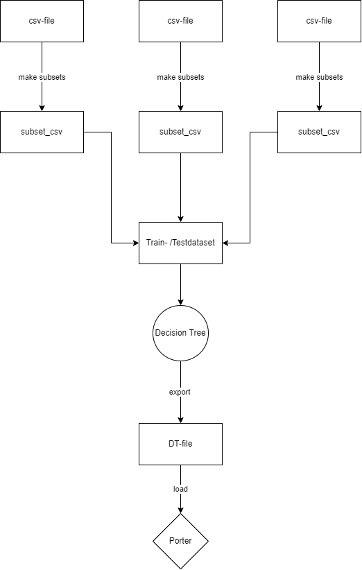
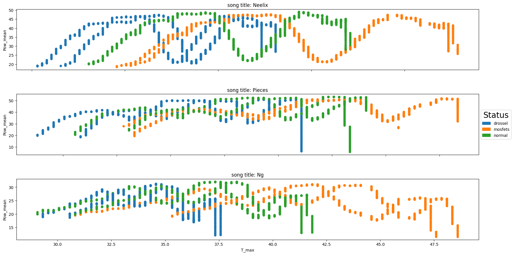

# Description:

## Background:
Repository which processes the recordings/data of DCDC-Converter regarding V_in, V_out, Current, OnBoard temperature and room temperature. It contains all the necessary 
preprocessing function to clean the data, transform it into the right data format and stores the final dataset for train-, test- and validationset. Further it also includes the Machine Learning part.




## Installation:
#### using python 3.10.xx

```python
# Create environment and upgrade package manager
python3 -m venv venv

# Activate venv
venv\Scripts\activate

# Install the requirements
pip install -r requirements.txt
```

### Hint:
Add the persons names in TrainPictures.py Line 40 and in VerifyPictures.py Line 59 (Marked as TODO).  
Add an empty folder (or folder structure).

## Generate Pictures for folder:
First, the Script need one parse argument, named output.
Output is the path of the saved pictures taken in the video stream.  
While the video stream is running and the wanted face is in the video frame of your webcam, you can press the key "K" to temporarly save a picture. If all pictures are taken the window closes and saves all pictures in the output folder by pressing the key "Q".

```python
# Execute GeneratePictures.py
python GeneratePictures.py --output Pictures\<NAME?>
```

## Training of the pictures
As the next step, all made pictures needs to be trained to a given person, that the recognizer knows which picture belongs to the correct person.

```python
# Execute TrainPictures.py
python TrainPictures.py
```

## Test the recognition
As the last step, the recognition can be tested.  
The window is going to be closed by pressing the key "Q".

```python
# Execute VerifyPictures.py
python VerifyPictures.py
```